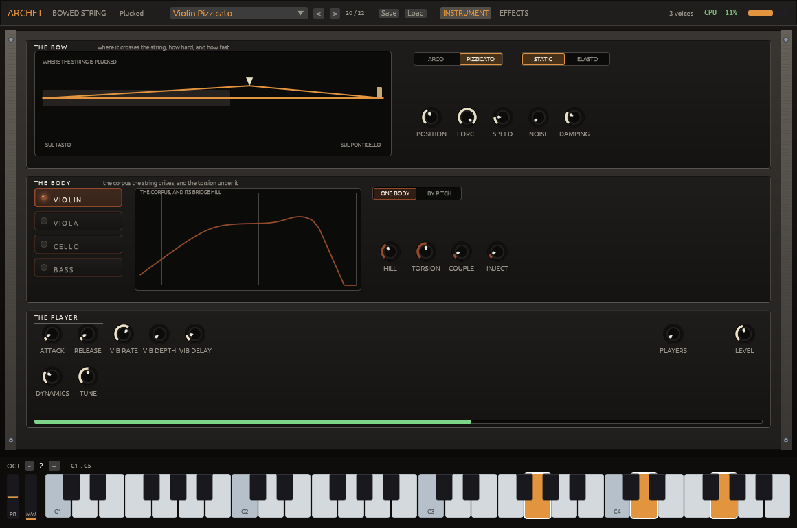
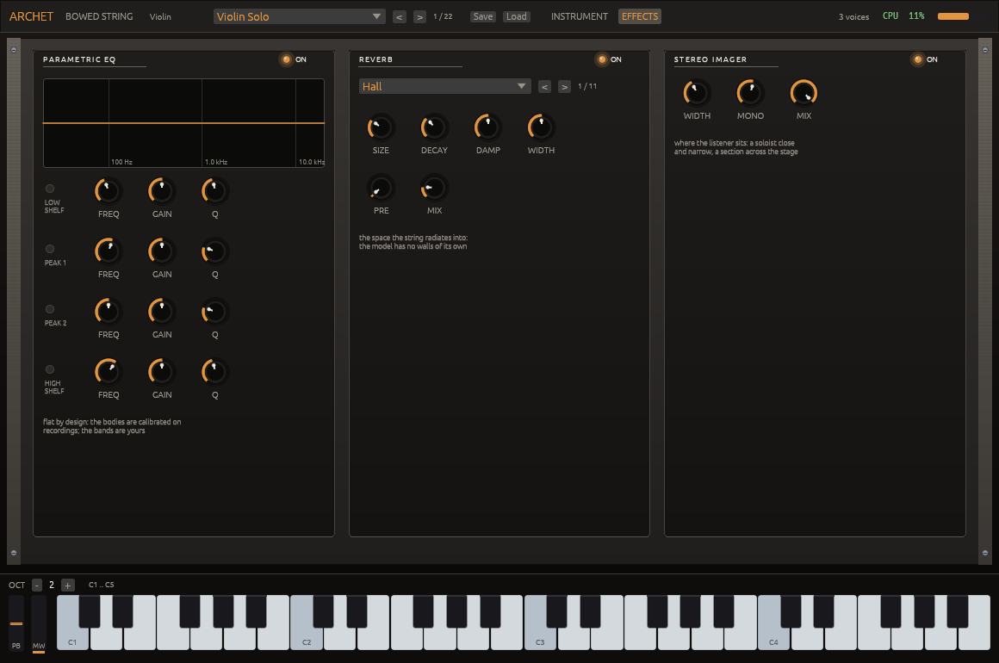

# Archet

**EXPERIMENTAL.** Under development and not yet judged in use: the sound, the
factory bank and the editor can change from one version to the next. What
cannot change is listed in `COMPAT.md`. What is known to be missing is listed
below.

A bowed string built from the acoustics literature and calibrated on anechoic
recordings, not from samples. The string is modal (Demoucron), driven by a
one-point friction interaction that solves the stick-slip of the bow; the
bridge force runs into a body of measured signature modes over a statistical
bank laid out at a measured modal overlap. Four bodies, violin, viola, cello
and double bass, each with its own measured modes; sympathetic open strings
behind them; a pizzicato that releases the same string from a finger and lets
it ring with the per-partial decays measured on each open string, then mutes
it with the hand; and a section mode that renders a decorrelated desk of
players rather than phase-locked clones. `REFERENCES.md` lists the sources.

## The editor

Three bands. The bow: where it crosses the string, from sul tasto to sul
ponticello, how hard and how fast, with the friction model and the noise
and damping of the stroke. The body: which of the four, its response with
the bridge hill drawn, and the torsion under it. The player: attack and
release, the vibrato, the dynamics, the size of the section, the level.
The keyboard below plays it.

The same instrument plucked: the band shows where the finger takes the
string instead of where the bow crosses it.

Behind a switch, the effects the patch carries: an equaliser that ships
flat, the space the string radiates into, and a ceiling. Which three and
in what order is fixed; everything inside them is the player's.

`scripts/screenshots.sh` renders these headless from the editor's own
snapshot tests and `--check` fails when the pictures fall behind it.

## Effects

The engine owns no effects. Each patch describes a chain of three, in a
fixed order, that the plugin runs after the engine: a parametric
equaliser, flat by design since the bodies are calibrated on recordings;
a reverb, because a string radiates into a room and the model has no
walls of its own, set per preset to a chamber for a soloist, a hall for a
section, a concert hall for a full string body and a room for plucked
strings; and a brickwall ceiling, the same for every preset. The chain is
part of the patch and travels with a project; a project saved before it
existed carries an empty chain, which is a real no-op. `COMPAT.md` says
what of this is frozen.

## Layout

    crates/archet            the engine, and the chain it describes but never runs
    crates/archet-ui         the egui editor
    crates/archet-plugin     VST3 / CLAP, via nice-plug
    vendor/phonix-sdk        the shared phonix crates, vendored

The editor is a separate crate rather than a feature of the engine, and that
is load-bearing. Cargo unifies features across a resolved graph, so an
optional `egui` inside `archet` would be switched on for the engine's own
tests by any `cargo test --workspace`. A crate boundary is the only thing
that makes "the engine never sees egui" true rather than merely intended:

    cargo tree -p archet --edges normal

## Building

    cargo test
    scripts/build_plugins.sh        # VST3 + CLAP bundle for this platform
    scripts/build_plugins.sh --windows

The bundle lands in `target/bundled/<platform>/`, laid out as the VST3 spec
wants. Any host that scans a directory will find it there; for a development
tree, point the host's search path at it rather than installing.

## Measuring

The engine carries its measurements as ignored tests under
`engine::profile` and `body::tests`: held bowed notes, plucked open strings,
scored passages read from files, the bodies' impulse responses. They write
to `/tmp` and print what a recording would be compared against.

    cargo test --lib engine::profile::bow_held -- --ignored --nocapture
    cargo test --lib engine::profile::pizz_family -- --ignored --nocapture
    ARCHET_SCORE=<dir> cargo test --lib engine::profile::score_render -- --ignored --nocapture

Three tests pin the rendered audio bit for bit (the engine sweep, the bowed
section, the body); a change that moves the sound moves a pin, and the commit
that moves it says so.

## Known limits

`LIMITATIONS.md` lists what the measurements found and left open, with
the date of each measurement and what was tried. `REFERENCES.md` lists
the published work the model implements and the recordings it was
calibrated on.

## Compatibility

`COMPAT.md` lists what cannot change: the VST3 class id, the parameter ids,
the patch's serde field names and their defaults, and the factory bank's
names *and order*.

## Licence

MIT or Apache-2.0, at your option; `LICENSE-MIT` and `LICENSE-APACHE` are
both here. Third-party work and its terms are listed in `NOTICE`.

One thing to know before redistributing a **built** plugin. The VST3 wrapper
comes from nice-plug, which reaches VST3 through `vst3-sys`, and `vst3-sys` is
GPLv3; nice-plug's own manifest says its `vst3` feature "exists mostly for
GPL-compliance reasons". So the source in this repository is MIT/Apache-2.0, but
a compiled `.vst3` (and the `.clap` built alongside it, which is the same shared
object) is a combined work with GPLv3 code and carries GPL-3.0 obligations.
`scripts/build_plugins.sh` builds both from one cdylib with nice-plug's default
features, which include `vst3`. A CLAP-only build with that feature turned off
would link `clap-sys`, which is MIT/Apache-2.0, and nothing GPL; that is the
switch to reach for if the GPL terms are not wanted.
